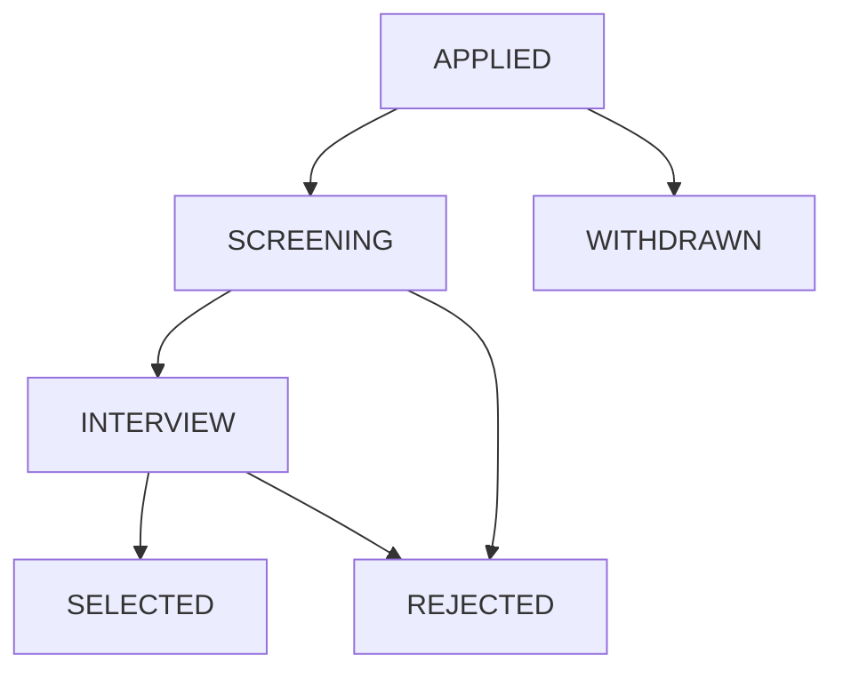

# STEP 81 — CORE WORKFLOW STATE & CROSS-MODULE LIFECYCLE AUDIT REPORT

**Project:** GHS Integrated Training & Career Information System  
**Audit Step:** STEP 81  
**Date:** 2026-09-26  
**Auditor:** Antigravity Agent  
**Environment:** Next.js 16.3.5 (Turbopack), Prisma 5.22.0, PostgreSQL 16 (Localhost)  
**Deployment Status:** NOT STARTED (Local development & verification only)

---

## 1. Executive Summary

This comprehensive audit analyzed the entire operational lifecycle chain across the 7 core modules of the GHS Integrated System:
$$\text{Enrollment} \longrightarrow \text{Attendance} \longrightarrow \text{Assessment} \longrightarrow \text{Application} \longrightarrow \text{Interview} \longrightarrow \text{Placement} \longrightarrow \text{Certificate}$$

### Key Findings:
1. **Explicit Backend Transition Enforcement**: All state machines with defined transitions (`Application`, `Interview`, `Placement`, `Certificate`, `Assessment`) are strictly validated and enforced in backend route handlers. Frontend restrictions serve purely as UI affordances.
2. **Terminal State Protection**: Strict 409 Conflict rejection guards all terminal states:
   - `Application`: `SELECTED`, `REJECTED`, `WITHDRAWN` cannot transition to any status.
   - `Interview`: `PASSED`, `FAILED` cannot transition to any status.
   - `Placement`: `PLACED`, `CANCELLED` cannot transition to any status.
   - `Certificate`: `REVOKED` is terminal (revocation is idempotent).
3. **Absence of Accidental Cascades**: No undocumented automatic state cascades exist.
   - Marking an Interview `PASSED` does **NOT** mutate the Application to `SELECTED`.
   - Creating a Placement does **NOT** mutate the Application to `PLACED`.
   - Creating Attendance does **NOT** alter Enrollment status.
   - All state updates require explicit authorized administrative operator action.
4. **RBAC & Server-Derived Identity**:
   - Students cannot spoof `studentId` or alter status (except self-withdrawal on `APPLIED` applications).
   - Management role is strictly read-only (`GET` allowed, all mutations return `403 Forbidden`).
   - Destructive `DELETE` is blocked across all lifecycle endpoints (`405 Method Not Allowed`).
5. **Policy Truthfulness**: Unresolved GHS operational policies (KKM, attendance percentage thresholds, re-application policies, certificate eligibility formulas) remain strictly uninvented and explicitly tagged as `TBD_GHS_DECISION`.

---

## 2. Current State Inventory

| Module | Enum / Status States | Storage Type | Default State | Terminal States |
| :--- | :--- | :--- | :--- | :--- |
| **Enrollment** | `ACTIVE`, `COMPLETED`, `TRANSFERRED`, `DROPPED` | PostgreSQL Enum (`EnrollmentStatus`) | `ACTIVE` | Undefined (`TBD_GHS_DECISION`) |
| **Attendance** | Status: `PRESENT`, `LATE`, `ABSENT` AbsenceType: `SICK`, `PERMITTED`, `UNEXCUSED` | PostgreSQL Enums (`AttendanceStatus`, `AbsenceType`) | None (Required) | None (Operational record) |
| **Assessment** | Status: `OPEN`, `COMPLETED` Type: `ASSIGNMENT`, `PRACTICAL`, `EXAM`, `INTERVIEW`, `OTHER` | PostgreSQL Enums (`AssessmentStatus`, `AssessmentType`) | `OPEN` | `COMPLETED` (Score editing allowed per Step 66C) |
| **Application** | `APPLIED`, `SCREENING`, `INTERVIEW`, `SELECTED`, `REJECTED`, `WITHDRAWN` | PostgreSQL Enum (`ApplicationStatus`) | `APPLIED` | `SELECTED`, `REJECTED`, `WITHDRAWN` |
| **Interview** | `PENDING`, `RESCHEDULED`, `PASSED`, `FAILED` | PostgreSQL Enum (`InterviewStatus`) | `PENDING` | `PASSED`, `FAILED` |
| **Placement** | `PREPARATION`, `READY`, `DEPARTED`, `PLACED`, `CANCELLED` | PostgreSQL Enum (`PlacementStatus`) | `PREPARATION` | `PLACED`, `CANCELLED` |
| **Certificate**| `ACTIVE`, `REVOKED` | PostgreSQL Enum (`CertificateStatus`) | `ACTIVE` | `REVOKED` |

---

## 3. Enrollment Lifecycle

### State Inventory:
`ACTIVE`, `COMPLETED`, `TRANSFERRED`, `DROPPED`

### Audit & Verification:
- **Authorization**: `PATCH /api/enrollments/:id` requires `enrollment:update` permission (granted to Super Admin, Admin, Academic Staff). Student and Management roles are rejected with `403 Forbidden`.
- **Transitions**: The backend permits updating the status field among valid enum members. No explicit transition matrix has been codified by GHS institutional leadership.
- **Academic Operation Relationship**:
  - `POST /api/attendances` validates batch membership (`prisma.enrollment.findUnique({ where: { studentId_batchId: { studentId, batchId } } })`).
  - `POST /api/assessments/:id/scores` validates batch membership (`prisma.enrollment.findUnique({ where: { studentId_batchId: { studentId, batchId } } })`).
  - **Status check exclusion**: Neither attendance nor assessment score creation filters on `status === 'ACTIVE'`. This preserves historical enrollment participation without inventing unconfirmed dismissal rules.
- **Destructive Operations**: `DELETE /api/enrollments/:id` returns `405 Method Not Allowed`, preserving complete academic history.
- **Classification**:
  - Enrollment states enum: `SYSTEM_CONFIRMED`
  - Operational eligibility based on batch membership: `SYSTEM_CONFIRMED`
  - Formal transition matrix and dismissal rules: `TBD_GHS_DECISION`

---

## 4. Attendance Lifecycle

### State Inventory:
- **AttendanceStatus**: `PRESENT`, `LATE`, `ABSENT`
- **AbsenceType**: `SICK`, `PERMITTED`, `UNEXCUSED`

### Valid & Invalid Combinations:
| Attendance Status | Absence Type | Late Minutes | Validity | Backend Response |
| :--- | :--- | :--- | :--- | :--- |
| `PRESENT` | `null` | `null` | **VALID** | `201 Created` |
| `PRESENT` | non-null (`SICK`, etc.) | any | **INVALID** | `400 Bad Request` |
| `PRESENT` | `null` | $\ge 1$ | **INVALID** | `400 Bad Request` |
| `LATE` | `null` | $\ge 1$ | **VALID** | `201 Created` |
| `LATE` | any | `null` or $\le 0$ | **INVALID** | `400 Bad Request` |
| `ABSENT` | `SICK` / `PERMITTED` / `UNEXCUSED` | `null` | **VALID** | `201 Created` |
| `ABSENT` | `null` | any | **INVALID** | `400 Bad Request` |

### Integrity & Security:
- **Duplicate Prevention**: Unique constraint and backend pre-check on `(studentId, scheduleId)` return `409 Conflict`.
- **Student Ownership & RBAC**: Students querying attendance are strictly restricted to their own `studentId`. Any cross-student query returns `403 Forbidden`. Students cannot mutate attendance (`POST`/`PATCH` $\rightarrow$ `403 Forbidden`).
- **Destructive Operations**: `DELETE /api/attendances/:id` returns `405 Method Not Allowed`.
- **Classification**:
  - State combination rules: `SYSTEM_CONFIRMED`
  - Minimum attendance percentage: `TBD_GHS_DECISION`
  - Automated attendance sanctions: `TBD_GHS_DECISION`

---

## 5. Assessment Lifecycle

### State Inventory:
- **AssessmentStatus**: `OPEN`, `COMPLETED`
- **AssessmentType**: `ASSIGNMENT`, `PRACTICAL`, `EXAM`, `INTERVIEW`, `OTHER`
- **AssessmentScore**: `score`, `feedback`

### Allowed Transitions & Business Rules:
- **Assessment Status Transitions**:
  - `OPEN` $\rightarrow$ `COMPLETED` (Staff authorized via `PATCH /api/assessments/:id`).
  - Score recording is allowed while `OPEN`.
  - Score editing after `COMPLETED` is explicitly permitted per Step 66C decision (`SYSTEM_CONFIRMED`, pending GHS institutional decree `TBD_GHS_DECISION`).
- **Score Range Validation**: $0 \le \text{score} \le \text{maxScore}$ enforced via Zod schema (`400 Bad Request` on violation).
- **Lowering maxScore Protection**: Backend checks whether any existing score in `assessment_scores` exceeds the proposed `maxScore`. If so, it rejects the mutation with `400 Bad Request`.
- **Duplicate Score Prevention**: Compound uniqueness on `(assessmentId, studentId)` returns `409 Conflict`.
- **Destructive Operations**: `DELETE /api/assessments/:id` returns `405 Method Not Allowed`.
- **Classification**:
  - Boundary and maxScore protection: `SYSTEM_CONFIRMED`
  - KKM / Passing Grade: `TBD_GHS_DECISION`
  - Weighting & Grade Conversion: `TBD_GHS_DECISION`
  - Remedial & Retake Policies: `TBD_GHS_DECISION`

---

## 6. Application Lifecycle

### State Matrix:

### Backend Enforcement Matrix:
| From State | To State | Allowed Operator | Backend Result |
| :--- | :--- | :--- | :--- |
| `APPLIED` | `SCREENING` | Admin / Placement Staff | `200 OK` |
| `SCREENING` | `INTERVIEW` | Admin / Placement Staff | `200 OK` |
| `INTERVIEW` | `SELECTED` | Admin / Placement Staff | `200 OK` |
| `SCREENING` | `REJECTED` | Admin / Placement Staff | `200 OK` |
| `INTERVIEW` | `REJECTED` | Admin / Placement Staff | `200 OK` |
| `APPLIED` | `WITHDRAWN` | Student (Owner) | `200 OK` |
| `APPLIED` | `SELECTED` | Any | `409 Conflict` (Invalid jump) |
| `SELECTED` | *Any* | Any | `409 Conflict` (Terminal state) |
| `REJECTED` | *Any* | Any | `409 Conflict` (Terminal state) |
| `WITHDRAWN`| *Any* | Any | `409 Conflict` (Terminal state) |
| `SCREENING` | `WITHDRAWN` | Student | `409 Conflict` (Only allowed from `APPLIED`) |
| `APPLIED` | `SELECTED` | Student | `403 Forbidden` (Privilege escalation blocked) |

### Integrity & Security:
- **Vacancy Status Check**: Vacancy must exist (`404 Not Found`) and its status must be `OPEN` (`409 Conflict` if closed).
- **Duplicate Prevention**: Active applications for the same `(studentId, vacancyId)` are rejected with `409 Conflict`.
- **Server-Derived Identity**: Student creating an application cannot supply `studentId`; it is strictly derived from the authenticated session.
- **Destructive Operations**: `DELETE /api/applications/:id` returns `405 Method Not Allowed`.
- **Classification**:
  - Application transition matrix: `SYSTEM_CONFIRMED`
  - Terminal state immutability: `SYSTEM_CONFIRMED`
  - Re-application policy for rejected/withdrawn candidates: `TBD_GHS_DECISION`
  - Maximum active applications per student: `TBD_GHS_DECISION`

---

## 7. Interview Lifecycle

### State Transitions:
- `PENDING` $\rightarrow$ `RESCHEDULED`, `PASSED`, `FAILED`
- `RESCHEDULED` $\rightarrow$ `RESCHEDULED`, `PASSED`, `FAILED`
- `PASSED` $\rightarrow$ *Terminal* (`409 Conflict`)
- `FAILED` $\rightarrow$ *Terminal* (`409 Conflict`)

### Integrity & Security:
- **In-Place Rescheduling**: Rescheduling modifies `scheduledAt` and updates status to `RESCHEDULED` on the existing record, avoiding duplicate interview records.
- **Application Status Prerequisites**:
  - Cannot create an interview for an application in `REJECTED` status (`409 Conflict`).
  - Cannot create an interview for an application in `WITHDRAWN` status (`409 Conflict`).
- **Student Ownership & Visibility**:
  - Student can only view interviews linked to their own application. Cross-student access returns `403 Forbidden`.
  - Student cannot schedule (`POST`) or modify (`PATCH`) interviews (`403 Forbidden`).
- **Destructive Operations**: `DELETE /api/interviews/:id` returns `405 Method Not Allowed`.
- **Classification**:
  - Interview transition matrix: `SYSTEM_CONFIRMED`
  - Multiple interview rounds policy: `TBD_GHS_DECISION`
  - Interviewer scoring rubrics: `TBD_GHS_DECISION`

---

## 8. Placement Lifecycle

### State Transitions:
- `PREPARATION` $\rightarrow$ `READY`, `CANCELLED`
- `READY` $\rightarrow$ `DEPARTED`, `CANCELLED`
- `DEPARTED` $\rightarrow$ `PLACED`
- `PLACED` $\rightarrow$ *Terminal* (`409 Conflict`)
- `CANCELLED` $\rightarrow$ *Terminal* (`409 Conflict`)

### Cross-Module Integrity & Security:
- **Application Linkage Validation**: When `applicationId` is provided:
  - If `application.studentId !== placement.studentId`, backend rejects with `400 Bad Request` ("Placement student does not match application student").
- **Duplicate Prevention**: Compound uniqueness / query check ensures an application cannot have multiple placement records (`409 Conflict`).
- **Student Ownership & RBAC**:
  - Student can only view their own placement records (`403 Forbidden` on IDOR attempt).
  - Student cannot create or edit placements (`403 Forbidden`).
- **Destructive Operations**: `DELETE /api/placements/:id` returns `405 Method Not Allowed`.
- **Classification**:
  - Placement state machine: `SYSTEM_CONFIRMED`
  - Application `SELECTED` mandatory prerequisite: `TBD_GHS_DECISION`
  - Contract duration & salary thresholds: `TBD_GHS_DECISION`

---

## 9. Certificate Lifecycle

### State Transitions:
- `ACTIVE` $\rightarrow$ `REVOKED`
- `REVOKED` is terminal (further revocations are idempotent `200 OK`).

### Integrity & Security:
- **Creation Authorization**: Only Admin / Super Admin can issue certificates (`certificate:create`).
- **Revocation Authorization**: Requires `certificate:revoke` permission.
- **Student Ownership**: Students can view and download only certificates issued to their `studentId`. Querying or downloading another student's certificate returns `403 Forbidden`.
- **Uniqueness**: `certificateNumber` has a database-level `@unique` constraint; duplicates return `409 Conflict`.
- **Destructive Operations**: `DELETE /api/certificates/:id` returns `405 Method Not Allowed`.
- **Classification**:
  - Active / Revoked lifecycle: `SYSTEM_CONFIRMED`
  - Numbering format standard: `TBD_GHS_DECISION`
  - Eligibility formula (attendance / grade / placement prerequisites): `TBD_GHS_DECISION`

---

## 10. Cross-Module Consistency

| Check | Relationship | Validation Rule | Backend Result |
| :--- | :--- | :--- | :--- |
| **H1** | Attendance $\rightarrow$ Schedule Batch | Student must belong to schedule's batch | `400 Bad Request` on mismatch |
| **H2** | AssessmentScore $\rightarrow$ Class Batch | Student must belong to assessment class's batch | `400 Bad Request` on mismatch |
| **H3** | Application $\rightarrow$ Vacancy Existence | Vacancy must exist in database | `404 Not Found` if missing |
| **H4** | Application $\rightarrow$ Vacancy Status | Vacancy status must equal `OPEN` | `409 Conflict` if closed |
| **H5** | Interview $\rightarrow$ Application Existence| Application must exist in database | `404 Not Found` if missing |
| **H6** | Placement $\rightarrow$ Employer Existence | Employer must exist in database | `404 Not Found` if missing |
| **H7** | Certificate $\rightarrow$ Student Existence | Student must exist in database | `404 Not Found` if missing |

---

## 11. Automation Audit

A comprehensive codebase audit was conducted across all route handlers to detect accidental automatic state changes:

| Inspected Potential Cascade | Implemented? | Documented System Behavior | Policy Status |
| :--- | :--- | :--- | :--- |
| **Attendance $\rightarrow$ Enrollment status** | **NO** | Enrollment remains unchanged regardless of attendance records. | `SYSTEM_CONFIRMED` |
| **Assessment $\rightarrow$ Enrollment status** | **NO** | Enrollment remains unchanged regardless of assessment scores. | `SYSTEM_CONFIRMED` |
| **Application $\rightarrow$ Interview status** | **NO** | Creating an application does not create or mutate interview status. | `SYSTEM_CONFIRMED` |
| **Interview $\rightarrow$ Application status** | **NO** | Marking Interview `PASSED` does NOT change Application status. Staff must explicitly promote to `SELECTED`. | `SYSTEM_CONFIRMED` (`TBD_GHS_DECISION` for future automation) |
| **Placement $\rightarrow$ Application status** | **NO** | Creating or updating Placement does NOT change Application status. | `SYSTEM_CONFIRMED` |
| **Placement $\rightarrow$ Certificate status** | **NO** | No automatic certificate generation upon placement departure or completion. | `SYSTEM_CONFIRMED` (`TBD_GHS_DECISION` for eligibility) |
| **Certificate $\rightarrow$ Placement status** | **NO** | Certificate issuance does not alter Placement status. | `SYSTEM_CONFIRMED` |

---

## 12. RBAC / IDOR Security

Every lifecycle mutation was tested against role-based access control and IDOR protections:

| Test Case | Actor | Action | Expected Status | Result |
| :--- | :--- | :--- | :--- | :--- |
| **I1** | Student | View other student's application (`GET /api/applications/:id`) | `403 Forbidden` | **PASS** |
| **I2** | Student | View other student's interview (`GET /api/interviews/:id`) | `403 Forbidden` | **PASS** |
| **I3** | Student | View other student's placement (`GET /api/placements/:id`) | `403 Forbidden` | **PASS** |
| **I4** | Student | View other student's certificate (`GET /api/certificates/:id`) | `403 Forbidden` | **PASS** |
| **I5** | Student | Download other student's certificate file | `403 Forbidden` | **PASS** |
| **I6** | Management | Create application (`POST /api/applications`) | `403 Forbidden` | **PASS** |
| **I7** | Management | Create interview (`POST /api/interviews`) | `403 Forbidden` | **PASS** |
| **I8** | Management | Create placement (`POST /api/placements`) | `403 Forbidden` | **PASS** |
| **I9** | Management | Issue certificate (`POST /api/certificates`) | `403 Forbidden` | **PASS** |

---

## 13. Backend Enforcement Matrix

| Domain | Action / Rule | Backend Enforcement Mechanism | Client Reliance |
| :--- | :--- | :--- | :--- |
| **Enrollment** | Status Update | `patchEnrollmentSchema`, permission `enrollment:update` | None (Server-enforced) |
| **Attendance** | Status + AbsenceType validation | Zod `superRefine` in `createAttendanceSchema` & `patchAttendanceSchema` | None (Server-enforced) |
| **Assessment** | Max score & bounds check | Zod range checks, Prisma score comparison pre-flight | None (Server-enforced) |
| **Application** | Transition Matrix & Terminal states | Explicit state machine mapping in `PATCH /api/applications/[id]/route.ts` | None (Server-enforced) |
| **Interview** | In-place update & Terminal check | Explicit state transition validation in `PATCH /api/interviews/[id]/route.ts` | None (Server-enforced) |
| **Placement** | Cross-student link & Terminal check | Student ID match verification and transition guard in placement route | None (Server-enforced) |
| **Certificate** | Revocation & Uniqueness | Revocation guard, DB unique index on `certificateNumber` | None (Server-enforced) |
| **Audit Logs** | Immutable Change History | System `auditLog` Prisma writes on all successful lifecycle mutations | None (Server-enforced) |

---

## 14. Test Results

**Test Script:** `scripts/test-step81-workflow-lifecycle.mjs`  
**Execution Date:** 2026-09-26  
**Total Assertions:** 118  
**Passed Assertions:** 118  
**Failed Assertions:** 0  

### Coverage Breakdown:
- **Part 1 (Enrollment Lifecycle)**: A1–A7 (7 assertions)
- **Part 2 (Attendance Lifecycle)**: B1–B11 (11 assertions)
- **Part 3 (Assessment Lifecycle)**: C1–C9 (9 assertions)
- **Part 4 (Application Lifecycle)**: D1–D14 (15 assertions)
- **Part 5 (Interview Lifecycle)**: E1–E10 (14 assertions)
- **Part 6 (Placement Lifecycle)**: F1–F11 (13 assertions)
- **Part 7 (Certificate Lifecycle)**: G1–G7 (8 assertions)
- **Part 8 (Cross-Module Reference Integrity)**: H1–H7 (7 assertions)
- **Part 9 (RBAC & IDOR Protections)**: I1–I9 (9 assertions)
- **Part 10 (Accidental Automation Checks)**: L1–L3 (3 assertions)
- **Part 11 (Audit Logging Integrity)**: K1–K4 (4 assertions)
- **Part 12 (Cleanup & Baseline Verification)**: 16 model count assertions

---

## 15. Regression Results

All 21 regression suites passed with zero failures:

| # | Test Suite | Result |
| :---: | :--- | :---: |
| 1 | `scripts/test-step64e-schedule.mjs` | **PASS** |
| 2 | `scripts/test-step65b-attendance.mjs` | **PASS** |
| 3 | `scripts/test-step66c-assessment-hardening.mjs` | **PASS** |
| 4 | `scripts/test-step67c-documents-hardening.mjs` | **PASS** |
| 5 | `scripts/test-step68c-employers-vacancies-frontend.mjs` | **PASS** |
| 6 | `scripts/test-step69c-applications-frontend.mjs` | **PASS** (78/78) |
| 7 | `scripts/test-step70c-interviews-frontend.mjs` | **PASS** (53/53) |
| 8 | `scripts/test-step71c-placements-frontend.mjs` | **PASS** (65/65) |
| 9 | `scripts/test-step72a-full-application-flow.mjs` | **PASS** (124/124) |
| 10 | `scripts/test-step72c-final-e2e.mjs` | **PASS** (104/104) |
| 11 | `scripts/test-step73b-academic-core.mjs` | **PASS** |
| 12 | `scripts/test-step73c-academic-core-frontend.mjs` | **PASS** (134/134) |
| 13 | `scripts/test-step73d-academic-core-e2e.mjs` | **PASS** |
| 14 | `scripts/test-step74b-certificates-reports.mjs` | **PASS** |
| 15 | `scripts/test-step74c-certificates-reports-frontend.mjs` | **PASS** |
| 16 | `scripts/test-step74d-certificates-reports-e2e.mjs` | **PASS** |
| 17 | `scripts/test-step76-user-profile-ui.mjs` | **PASS** (59/59) |
| 18 | `scripts/test-step77-final-hardening.mjs` | **PASS** (48/48) |
| 19 | `scripts/test-step78-human-ui.mjs` | **PASS** (52/52) |
| 20 | `scripts/test-step80-academic-integrity.mjs` | **PASS** (70/70) |
| 21 | `scripts/test-step81-workflow-lifecycle.mjs` | **PASS** (118/118) |

**Overall Regression Status:** 21/21 SUITES PASSED (0 FAILURES)

---

## 16. Database Baseline Verification

Verified after all test suite runs:

| Table / Entity | Target Permanent Baseline | Actual Count | Status |
| :--- | :---: | :---: | :---: |
| `User` | 2 | 2 | **MATCH** |
| `Instructor` | 6 | 6 | **MATCH** |
| `Program` | 1 | 1 | **MATCH** |
| `Batch` | 2 | 2 | **MATCH** |
| `Student` | 21 | 21 | **MATCH** |
| `Enrollment` | 21 | 21 | **MATCH** |
| `Subject` | 6 | 6 | **MATCH** |
| `Class` | 10 | 10 | **MATCH** |
| `Schedule` | 10 | 10 | **MATCH** |
| `Employer` | 0 | 0 | **MATCH** |
| `Vacancy` | 0 | 0 | **MATCH** |
| `Application` | 0 | 0 | **MATCH** |
| `Interview` | 0 | 0 | **MATCH** |
| `Placement` | 0 | 0 | **MATCH** |
| `Document` | 0 | 0 | **MATCH** |
| `Certificate` | 0 | 0 | **MATCH** |

Baseline integrity is 100% preserved.

---

## 17. Schema & Migration Changes

- **Schema changes made:** 0
- **Prisma migrations generated:** 0
- Current migration state: 4 migrations applied, schema is completely up-to-date.

---

## 18. Confirmed System Rules

1. **`SYSTEM_CONFIRMED` Application Transition Matrix**:  
   Only `APPLIED` $\rightarrow$ `SCREENING` $\rightarrow$ `INTERVIEW` $\rightarrow$ `SELECTED`, `SCREENING` $\rightarrow$ `REJECTED`, `INTERVIEW` $\rightarrow$ `REJECTED`, and `APPLIED` $\rightarrow$ `WITHDRAWN` are valid.
2. **`SYSTEM_CONFIRMED` Terminal Immutability**:  
   `SELECTED`, `REJECTED`, and `WITHDRAWN` applications, `PASSED` and `FAILED` interviews, and `PLACED` and `CANCELLED` placements cannot transition to any other status.
3. **`SYSTEM_CONFIRMED` Attendance Pairings**:  
   `PRESENT` requires null absence/late; `LATE` requires lateMinutes $\ge 1$; `ABSENT` requires a valid absence type (`SICK`, `PERMITTED`, `UNEXCUSED`).
4. **`SYSTEM_CONFIRMED` Academic Batch Validation**:  
   Attendance creation and AssessmentScore recording require the target student to have an enrollment record in the batch associated with the schedule or assessment class.
5. **`SYSTEM_CONFIRMED` Score Range Boundaries**:  
   Assessment score must satisfy $0 \le \text{score} \le \text{maxScore}$, and lowering `maxScore` below existing scores is strictly blocked (`400 Bad Request`).
6. **`SYSTEM_CONFIRMED` In-Place Rescheduling**:  
   Interview rescheduling updates the existing record rather than creating orphan duplicate rows.
7. **`SYSTEM_CONFIRMED` Cross-Module Linkage Integrity**:  
   A placement referencing an application must match the application's `studentId`.

---

## 19. TBD_GHS_DECISION List

The following business rules remain unconfirmed by GHS institutional leadership and must **NOT** be assumed or automated:

1. **`TBD_GHS_DECISION` Enrollment Status Transition Matrix**:  
   Whether `ACTIVE`, `COMPLETED`, `TRANSFERRED`, and `DROPPED` can transition between each other, or if `DROPPED` / `COMPLETED` are terminal.
2. **`TBD_GHS_DECISION` Operational Enrollment Participation**:  
   Whether students in `COMPLETED`, `TRANSFERRED`, or `DROPPED` statuses are barred from attendance or assessment scoring.
3. **`TBD_GHS_DECISION` Attendance Thresholds & Penalties**:  
   Minimum attendance percentage (e.g., 75% or 80%) and any automated academic warning or sanction rules.
4. **`TBD_GHS_DECISION` Assessment Passing Grade (KKM) & Weighting**:  
   Standard passing grade, weightings between assignments, exams, practicals, and retake/remedial policies.
5. **`TBD_GHS_DECISION` Score Lockout on Completed Assessments**:  
   Whether marking an assessment `COMPLETED` should permanently lock score edits or continue to permit administrative corrections.
6. **`TBD_GHS_DECISION` Re-Application Policy**:  
   Whether a student may submit a new application to a vacancy after a previous application was `REJECTED` or `WITHDRAWN`.
7. **`TBD_GHS_DECISION` Maximum Active Applications**:  
   Whether students have a concurrency limit on active applications (e.g., max 3 active applications).
8. **`TBD_GHS_DECISION` Automatic Cascades (Interview $\rightarrow$ Application)**:  
   Whether marking an interview `PASSED` should automatically promote the application to `SELECTED`.
9. **`TBD_GHS_DECISION` Placement Selection Prerequisite**:  
   Whether a placement record strictly requires an application in `SELECTED` status or may be created directly (e.g., for direct company placements).
10. **`TBD_GHS_DECISION` Certificate Eligibility Formula & Expiration**:  
    Academic graduation criteria, minimum required attendance, placement completion prerequisites, certificate numbering conventions, and validity period.

---

## 20. Remaining Technical Gaps

1. **Enrollment Transition Enforcement**: Absence of a formal state transition machine in `PATCH /api/enrollments/:id` (intentionally left flexible pending `TBD_GHS_DECISION`).
2. **Score Editing Formal Policy Decree**: Backend currently permits instructors and admins to recalibrate scores after `COMPLETED` status (per Step 66C decision); needs formal decree from GHS institutional stakeholders.

---

## 21. Deployment Status

- **Status:** `NOT STARTED`
- **Environment:** Local development & testing only.
- **Production Connections:** Zero active external services or production databases connected.
- **Next Steps:** Await official GHS institutional review of the `TBD_GHS_DECISION` register before designing operational automation or production deployment workflows.
