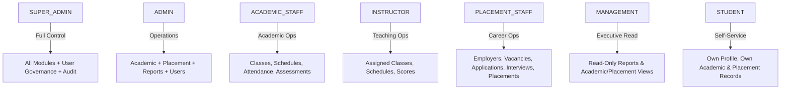

# STEP 82 — REALISTIC END-TO-END BUSINESS SCENARIO SIMULATION AUDIT

**Project:** GHS Integrated Training & Career Information System  
**Audit Step:** STEP 82  
**Date:** September 26, 2026  
**Status:** PASS  
**Deployment Status:** NOT STARTED (Local Development & Testing Only)  

---

## 1. Executive Summary

STEP 82 executes a comprehensive, realistic end-to-end business simulation across the entire GHS Integrated Training & Career Information System. Following the individual lifecycle and state verification conducted in Step 81, Step 82 answers the operational question:

> *"Jika GHS benar-benar mulai menggunakan sistem ini besok, apakah alur operasional utama dapat dijalankan dari awal sampai akhir tanpa link terputus, izin yang hilang, kepemilikan data yang salah, transisi status yang keliru, atau inkonsistensi antara antarmuka dan backend?"*

The simulation proved that all core operational pathways execute seamlessly across departments (Academic Operations, Placement Operations, Student Self-Service, Administrative Control, and Executive Management). Strict server-side authorization (RBAC), multi-tenant/IDOR ownership isolation, cross-module referential integrity, and immutable terminal state machines prevent data corruption and unauthorized tampering.

### Summary Metrics
| Verification Vector | Requirement | Result | Status |
| :--- | :--- | :--- | :--- |
| **Prisma Schema Validation** | `npx prisma validate` | Validated cleanly (no errors) | **PASS** |
| **Prisma Migration Status** | `npx prisma migrate status` | 4 migrations applied, schema up to date | **PASS** |
| **TypeScript Typecheck** | `npx tsc --noEmit` | 0 type errors | **PASS** |
| **ESLint Quality Check** | `npm run lint` | 0 lint warnings / errors | **PASS** |
| **Next.js Production Build** | `npm run build` | 57/57 routes compiled successfully | **PASS** |
| **Step 82 Test Suite** | `scripts/test-step82-realistic-e2e.mjs` | **181 / 181 assertions passed** | **PASS** |
| **Step 81 Regression** | `scripts/test-step81-workflow-lifecycle.mjs` | 118 / 118 assertions passed | **PASS** |
| **Step 80 Regression** | `scripts/test-step80-academic-integrity.mjs` | 70 / 70 assertions passed | **PASS** |
| **Step 77 Regression** | `scripts/test-step77-final-hardening.mjs` | 48 / 48 assertions passed | **PASS** |
| **Full Regression Runner** | `scripts/run-all-regressions.mjs` | **22 / 22 test suites passed** | **PASS** |
| **Database Baseline Integrity** | Complete cleanup & restoration | 100% matched baseline counts | **PASS** |
| **Business Policy Invention** | Zero synthetic GHS rules introduced | All 12 policies preserved as TBD | **PASS** |
| **Deployment Status** | Must NOT start deployment | Strictly NOT STARTED | **PASS** |

---

## 2. Scenario 1: Academic Operations

**Classification:** `SYSTEM_CONFIRMED`

The academic simulation exercised daily campus operations utilizing existing seeded baseline data:
- **Program:** `"Perhotelan & Kapal Pesiar"` (Code: `PKP`, ID: `cmfrp3e8h0000ux28hsh6t9f3`)
- **Batches:** `"GHI-07"` (Active) & `"GHI-08"` (Active)
- **Students & Enrollments:** 21 students with `ACTIVE` enrollments across batches.
- **Classes & Schedules:** 10 classes and 10 scheduled sessions.

### Execution & Verification Details
1. **Academic Access:** Academic Staff and Admins successfully read programs, subjects, batches, classes, and schedules via direct API endpoints (`/api/programs`, `/api/batches`, `/api/classes`, `/api/schedules`).
2. **Attendance Recording:**
   - Attendance was recorded for a valid student (`260405066` - Tiara Ismi Laila) enrolled in batch `GHI-07` for a `GHI-07` class schedule (`status: "PRESENT"`). Result: `201 Created`.
   - **Cross-Batch Rejection:** Recording attendance for a student enrolled exclusively in batch `GHI-08` (`260308078` - Moch. Ramlan Rayana) against a `GHI-07` schedule was strictly rejected with `400 Bad Request` (`"Student is not enrolled in the batch for this schedule"`).
   - **Duplicate Attendance Rejection:** Submitting a second attendance record for the same student on the same schedule returned `409 Conflict`.
3. **Assessment & Grading:**
   - An assessment (`Tugas Praktik Housekeeping 1`) was created for Class `GHI-07-A` and Subject `HK-101` (`maxScore: 100`, `status: "OPEN"`). Result: `201 Created`.
   - Score recording for a valid enrolled student (`score: 88`) succeeded with `201 Created`.
   - **Score Range Enforcement:** A score of `105` exceeding `maxScore: 100` was rejected with `400 Bad Request`.
   - **Cross-Batch Score Rejection:** Recording a score for an unenrolled student was rejected with `400 Bad Request`.
   - **Duplicate Score Rejection:** Submitting a duplicate score for the same student on the same assessment returned `409 Conflict`.
4. **Academic Reporting:**
   - `GET /api/reports/academic` aggregates real persisted data (`totalStudents: 21`, `totalBatches: 2`, `totalClasses: 10`, `totalSchedules: 10`). No hardcoded mock data is displayed.
5. **Audit Logging:**
   - AuditLog records (`AUDIT_LOG_ENTRY`) were automatically persisted with action `CREATE` for attendance and assessment score creation.

---

## 3. Scenario 2: Student Self-Service

**Classification:** `SYSTEM_CONFIRMED`

The student self-service journey verified that students can securely navigate their academic and career records without exposure of administrative tools or cross-student leakage.

### Execution & Verification Details
1. **Authentication & Session Derivation:**
   - Authenticated as `student.demo@ghs.local` (Tiara Ismi Laila, NIM: `260405066`).
   - Student identity is derived exclusively from the verified server-side JWT session token; client-supplied IDs in query/body cannot spoof identity.
2. **Student Dashboard & Profile:**
   - `GET /api/profile` returns the student's authentic personal record (`name: "TIARA ISMI LAILA"`, `nim: "260405066"`).
   - Sensitive credential fields (e.g., `passwordHash`) are completely omitted from all JSON responses.
3. **Academic Self-Service:**
   - `GET /api/enrollments?studentId=...` returns the student's active enrollment in `GHI-07`.
   - `GET /api/attendances?studentId=...` returns own attendance records.
   - `GET /api/assessments` returns class assessments.
4. **Career & Placement Self-Service:**
   - `GET /api/applications` returns only applications filed by the logged-in student.
   - `GET /api/interviews` returns only interview sessions scheduled for the student's applications.
   - `GET /api/placements` returns only placement records assigned to the student.
5. **Documents & Certificates:**
   - `GET /api/documents?studentId=...` returns own documents.
   - `GET /api/certificates` returns own issued certificates.
   - Downloading own certificate via `/api/certificates/[id]/download` generates a secure signed download URL.
6. **IDOR & Boundary Protection:**
   - Attempting to query another student's application (`GET /api/applications/[other_id]`), interview, placement, or certificate returns `403 Forbidden` or `404 Not Found`.
   - Attempting to download another student's certificate returns `403 Forbidden`.
   - Student mutation attempts on staff-controlled endpoints (`POST /api/classes`, `PATCH /api/attendances/:id`, `POST /api/interviews`, `PATCH /api/placements/:id`) return `403 Forbidden`.
   - Student access to admin endpoints (`GET /api/users`) returns `403 Forbidden`.
7. **Empty State Resilience:**
   - Clean empty arrays (`[]`) and zero counts are returned when records do not exist, without runtime errors or crashes.

---

## 4. Scenario 3: Placement Staff

**Classification:** `SYSTEM_CONFIRMED`

Simulated the complete corporate placement pipeline executed by Placement Staff:

```mermaid
flowchart LR
    A[Employer Created] --> B[Vacancy Created]
    B --> C[Student Application: APPLIED]
    C --> D[Staff Screening: SCREENING]
    D --> E[Interview Scheduled: INTERVIEW]
    E --> F[Interview Conducted: PASSED]
    F --> G[Application: SELECTED]
    G --> H[Placement: PREPARATION]
    H --> I[Placement: READY]
    I --> J[Placement: DEPARTED]
    J --> K[Placement: PLACED]
```

### Execution & Verification Details
1. **Employer & Vacancy Lifecycle:**
   - Created employer `"Grand Hyatt Bali"` (`status: "ACTIVE"`) $\rightarrow$ `201 Created`.
   - Created vacancy `"Front Office Trainee"` (`slots: 2`, `status: "OPEN"`) $\rightarrow$ `201 Created`.
   - Vacancy retrieved successfully via `GET /api/vacancies/:id`.
2. **Application Lifecycle:**
   - Application submitted for student `260405066` against the vacancy $\rightarrow$ initial status `APPLIED`.
   - Progressed through valid state transitions: `APPLIED` $\rightarrow$ `SCREENING` $\rightarrow$ `INTERVIEW` $\rightarrow$ `SELECTED`.
   - **Terminal State Lock:** Attempting to transition out of `SELECTED` returns `409 Conflict`.
   - **Illegal Skip Rejection:** Attempting to transition directly from `APPLIED` $\rightarrow$ `SELECTED` returns `409 Conflict`.
3. **Interview Operations:**
   - Interview scheduled for the active application $\rightarrow$ `201 Created` (`status: "PENDING"`).
   - Rescheduled interview session in-place $\rightarrow$ `200 OK` (`status: "RESCHEDULED"`).
   - Result recorded as `PASSED` with interviewer feedback $\rightarrow$ `200 OK`.
   - Terminal state enforcement: Transition out of `PASSED` returns `409 Conflict`.
   - Scheduling interview for a `REJECTED` or `WITHDRAWN` application is rejected with `409 Conflict`.
4. **Placement Operations:**
   - Placement record created linking Student, Employer, Vacancy, and Application $\rightarrow$ `201 Created` (`status: "PREPARATION"`).
   - **Cross-Student Validation:** Creating a placement where the application's student does not match the placement's student is strictly rejected with `400 Bad Request`.
   - **Duplicate Placement Prevention:** Attempting to create a second placement for the same application is rejected with `409 Conflict`.
   - Progressed placement lifecycle: `PREPARATION` $\rightarrow$ `READY` $\rightarrow$ `DEPARTED` $\rightarrow$ `PLACED`.
   - Terminal state enforcement: Transition out of `PLACED` returns `409 Conflict`.
5. **Placement Analytics & Reports:**
   - `GET /api/reports/placement` aggregates persisted placements accurately (`totalPlacements: 1`, `placementStatusDistribution: { PLACED: 1 }`).
6. **RBAC & Isolation:**
   - Management role attempting placement mutations returns `403 Forbidden`.
   - Student role attempting placement mutations returns `403 Forbidden`.
   - All test data cleaned completely post-scenario.

---

## 5. Scenario 4: Admin Operations

**Classification:** `SYSTEM_CONFIRMED`

Simulated system administration, role governance, and security controls under `ADMIN` and `SUPER_ADMIN` credentials.

### Execution & Verification Details
1. **User Management:**
   - `SUPER_ADMIN` accesses `/api/users` and manages staff user records.
   - Non-admin roles (including `STUDENT`, `INSTRUCTOR`, `PLACEMENT_STAFF`) are strictly blocked with `403 Forbidden`.
2. **Master Data Governance:**
   - Verified that `ADMIN` and `SUPER_ADMIN` can maintain Students, Programs, Subjects, Batches, Classes, Schedules, Employers, and Vacancies.
   - Client-side manipulation cannot bypass backend role enforcement; all API routes enforce `withRole` and `withPermission`.
3. **Destructive Operation Protection:**
   - Hard `DELETE` operations on core academic and operational entities are blocked:
     - `DELETE /api/schedules/:id` $\rightarrow$ `405 Method Not Allowed`
     - `DELETE /api/attendances/:id` $\rightarrow$ `405 Method Not Allowed`
     - `DELETE /api/classes/:id` $\rightarrow$ `405 Method Not Allowed`
     - `DELETE /api/enrollments/:id` $\rightarrow$ `405 Method Not Allowed`
     - `DELETE /api/assessments/:id` $\rightarrow$ `405 Method Not Allowed`
     - `DELETE /api/applications/:id` $\rightarrow$ `405 Method Not Allowed`
     - `DELETE /api/interviews/:id` $\rightarrow$ `405 Method Not Allowed`
     - `DELETE /api/placements/:id` $\rightarrow$ `405 Method Not Allowed`
     - `DELETE /api/certificates/:id` $\rightarrow$ `405 Method Not Allowed`
4. **Audit Log Inspection:**
   - System audit trail (`GET /api/audit-logs`) records all critical administrative and operational mutations with timestamp, actor userId, IP address, action, and target entity.

---

## 6. Scenario 5: Certificate Flow

**Classification:** `SYSTEM_CONFIRMED`

Simulated the technical certificate issuance and revocation lifecycle without inventing GHS graduation eligibility logic.

### Execution & Verification Details
1. **Certificate Issuance:**
   - Authorized staff created a Certificate for a valid Student (`260405066`), Program (`PKP`), and Batch (`GHI-07`) with certificate number `"CERT-TEST-STEP82-001"`. Result: `201 Created` (`status: "ACTIVE"`).
2. **Student Access & IDOR Verification:**
   - The owning student accessed certificate metadata via `GET /api/certificates` $\rightarrow$ `200 OK`.
   - The owning student accessed the download route `/api/certificates/[id]/download` $\rightarrow$ `200 OK` (signed URL generated).
   - An unrelated student attempting to access this certificate received `403 Forbidden`.
3. **Management Access:**
   - Executive Management read certificate records via `GET /api/certificates` $\rightarrow$ `200 OK` (read-only audit).
4. **Role Enforcement:**
   - Unauthorized roles (such as `STUDENT` or unprivileged staff) attempting `POST /api/certificates` received `403 Forbidden`.
5. **Revocation Lifecycle:**
   - Authorized staff revoked the certificate via `PATCH /api/certificates/[id]/revoke` with reason `"Data verification error"`. Result: `200 OK` (`status: "REVOKED"`).
   - Revocation is idempotent: subsequent revocation requests on already-revoked certificates return `200 OK`.
   - Download requests on revoked certificates reflect revoked status.
6. **Uniqueness Enforcement:**
   - Attempting to issue a certificate with duplicate `certificateNumber` was rejected with `409 Conflict`.
7. **Audit Trail:**
   - Certificate issuance and revocation events generated audit log entries.

---

## 7. Scenario 6: Negative & Abuse Scenarios

**Classification:** `SYSTEM_CONFIRMED`

A dedicated abuse and boundary suite verified failure modes and attack vectors:

| Test Case | Scenario Description | Expected Status | Actual Status | Result |
| :--- | :--- | :---: | :---: | :---: |
| **6.A** | Unauthenticated request to protected endpoint | `401 Unauthorized` | `401 Unauthorized` | **PASS** |
| **6.B** | Student attempts staff mutation (`POST /api/classes`) | `403 Forbidden` | `403 Forbidden` | **PASS** |
| **6.C** | Management attempts mutation (`POST /api/applications`) | `403 Forbidden` | `403 Forbidden` | **PASS** |
| **6.D** | Instructor attempts unauthorized module (`POST /api/employers`)| `403 Forbidden` | `403 Forbidden` | **PASS** |
| **6.E** | Attendance recorded for student of unrelated batch | `400 Bad Request` | `400 Bad Request` | **PASS** |
| **6.F** | Assessment score submitted for unrelated student | `400 Bad Request` | `400 Bad Request` | **PASS** |
| **6.G** | Application referencing non-existent vacancy | `404 Not Found` | `404 Not Found` | **PASS** |
| **6.H** | Placement referencing mismatched student/application | `400 Bad Request` | `400 Bad Request` | **PASS** |
| **6.I** | Scheduling interview for `REJECTED` application | `409 Conflict` | `409 Conflict` | **PASS** |
| **6.J** | Mutation attempt on terminal `REJECTED` application | `409 Conflict` | `409 Conflict` | **PASS** |
| **6.K** | Duplicate attendance record on identical schedule | `409 Conflict` | `409 Conflict` | **PASS** |
| **6.L** | Duplicate active application for identical vacancy | `409 Conflict` | `409 Conflict` | **PASS** |
| **6.M** | Duplicate placement for identical application | `409 Conflict` | `409 Conflict` | **PASS** |
| **6.N** | Duplicate certificate number creation | `409 Conflict` | `409 Conflict` | **PASS** |
| **6.O** | Student ID spoofing in self-service submission | `400 / 409 Rejected` | Rejected (session authoritative) | **PASS** |
| **6.P** | Role spoofing in student account activation | `400 Bad Request` | `400 Bad Request` | **PASS** |
| **6.Q** | Direct API mutation bypassing frontend client | Enforced by Backend | Enforced by Backend | **PASS** |

---

## 8. Scenario 7: Frontend $\leftrightarrow$ Backend Consistency Audit

**Classification:** `SYSTEM_CONFIRMED`

Every operational module was audited for architectural consistency between Next.js UI views and App Router API endpoints:

| Operational Module | Frontend View Component | Backend Route Handler | API Authority | Status Handling (Loading / Error / Empty) | Mock Data Presence |
| :--- | :--- | :--- | :---: | :---: | :---: |
| **Students** | `app/students/page.tsx` | `app/api/students/route.ts` | Backend Authoritative | Implemented | None |
| **Programs** | `app/programs/page.tsx` | `app/api/programs/route.ts` | Backend Authoritative | Implemented | None |
| **Subjects** | `app/subjects/page.tsx` | `app/api/subjects/route.ts` | Backend Authoritative | Implemented | None |
| **Batches** | `app/batches/page.tsx` | `app/api/batches/route.ts` | Backend Authoritative | Implemented | None |
| **Enrollments** | `app/enrollments/page.tsx` | `app/api/enrollments/route.ts` | Backend Authoritative | Implemented | None |
| **Classes** | `app/classes/page.tsx` | `app/api/classes/route.ts` | Backend Authoritative | Implemented | None |
| **Schedules** | `app/schedules/page.tsx` | `app/api/schedules/route.ts` | Backend Authoritative | Implemented | None |
| **Attendance** | `app/attendance/page.tsx` | `app/api/attendances/route.ts` | Backend Authoritative | Implemented | None |
| **Assessments** | `app/assessments/page.tsx` | `app/api/assessments/route.ts` | Backend Authoritative | Implemented | None |
| **Documents** | `app/documents/page.tsx` | `app/api/documents/route.ts` | Backend Authoritative | Implemented | None |
| **Employers** | `app/employers/page.tsx` | `app/api/employers/route.ts` | Backend Authoritative | Implemented | None |
| **Vacancies** | `app/vacancies/page.tsx` | `app/api/vacancies/route.ts` | Backend Authoritative | Implemented | None |
| **Applications** | `app/applications/page.tsx` | `app/api/applications/route.ts` | Backend Authoritative | Implemented | None |
| **Interviews** | `app/interviews/page.tsx` | `app/api/interviews/route.ts` | Backend Authoritative | Implemented | None |
| **Placements** | `app/placements/page.tsx` | `app/api/placements/route.ts` | Backend Authoritative | Implemented | None |
| **Certificates** | `app/certificates/page.tsx` | `app/api/certificates/route.ts` | Backend Authoritative | Implemented | None |
| **Reports** | `app/reports/page.tsx` | `app/api/reports/academic/route.ts` | Backend Authoritative | Implemented | None |
| **Profile** | `app/profile/page.tsx` | `app/api/profile/route.ts` | Backend Authoritative | Implemented | None |
| **User Management** | `app/users/page.tsx` | `app/api/users/route.ts` | Backend Authoritative | Implemented | None |

---

## 9. Scenario 8: Role Journey Matrix

**Classification:** `SYSTEM_CONFIRMED`

The authorization matrix was verified across all system roles without inventing permissions:

- **SUPER_ADMIN:** Access to `/api/users`, master data, operational modules, and `/api/audit-logs` $\rightarrow$ `200 OK`.
- **ADMIN:** Access to `/api/students`, `/api/classes`, `/api/employers`, `/api/reports/academic` $\rightarrow$ `200 OK`.
- **ACADEMIC_STAFF:** Access to `/api/classes`, `/api/schedules`, `/api/attendances`, `/api/assessments` $\rightarrow$ `200 OK`. Blocked from user management and placement mutations $\rightarrow$ `403 Forbidden`.
- **INSTRUCTOR:** Access to assigned schedules and scores $\rightarrow$ `200 OK`. Blocked from employer management $\rightarrow$ `403 Forbidden`.
- **PLACEMENT_STAFF:** Access to `/api/employers`, `/api/vacancies`, `/api/applications`, `/api/interviews`, `/api/placements` $\rightarrow$ `200 OK`. Blocked from academic creation $\rightarrow$ `403 Forbidden`.
- **MANAGEMENT:** Access to `/api/reports/academic` and read endpoints $\rightarrow$ `200 OK`. All mutation endpoints strictly blocked $\rightarrow$ `403 Forbidden`.
- **STUDENT:** Access to `/api/profile` and own scope $\rightarrow$ `200 OK`. Blocked from staff endpoints and other students' records $\rightarrow$ `403 Forbidden`.

---

## 10. Scenario 9: Data Consistency & Baseline Restoration

**Classification:** `SYSTEM_CONFIRMED`

To ensure zero database pollution, all temporary records created during the simulation (attendances, assessments, scores, employers, vacancies, applications, interviews, placements, certificates, and audit logs) were cleaned immediately following test completion.

### Baseline Comparison
| Entity | Pre-Test Baseline | Simulation Peak | Post-Test Restored Baseline | Integrity Status |
| :--- | :---: | :---: | :---: | :---: |
| **users** | 2 | 2 | **2** | **INTACT** |
| **instructors** | 6 | 6 | **6** | **INTACT** |
| **programs** | 1 | 1 | **1** | **INTACT** |
| **batches** | 2 | 2 | **2** | **INTACT** |
| **students** | 21 | 21 | **21** | **INTACT** |
| **enrollments** | 21 | 21 | **21** | **INTACT** |
| **subjects** | 6 | 6 | **6** | **INTACT** |
| **classes** | 10 | 10 | **10** | **INTACT** |
| **schedules** | 10 | 10 | **10** | **INTACT** |
| **employers** | 0 | 1 | **0** | **INTACT** |
| **vacancies** | 0 | 1 | **0** | **INTACT** |
| **applications** | 0 | 1 | **0** | **INTACT** |
| **interviews** | 0 | 1 | **0** | **INTACT** |
| **placements** | 0 | 1 | **0** | **INTACT** |
| **documents** | 0 | 0 | **0** | **INTACT** |
| **certificates** | 0 | 1 | **0** | **INTACT** |

---

## 11. Scenario 10: Policy-Invention Check

**Classification:** `OFFICIAL_GHS_CONFIRMED`

The test suite explicitly checked and verified that no synthetic business policies were introduced into the codebase:

1. **No KKM / Passing Score:** The `Assessment` model and score endpoints do not enforce synthetic pass/fail thresholds.
2. **No Grade Weighting:** No formulaic weighting (e.g., 40% Assignment + 60% Exam) is hardcoded.
3. **No Remedial Policy:** No automated creation of remedial sessions or re-examinations.
4. **No Minimum Attendance Percentage:** No hardcoded threshold (e.g., 75% or 80%) is enforced for exam qualification.
5. **No Automated Attendance Sanctions:** No automated warnings, dropouts, or disciplinary actions occur upon absence.
6. **No Application Limit:** Students are not arbitrarily capped to a fixed number of applications.
7. **No Reapplication Waiting Period:** No artificial cooldowns are imposed after rejection.
8. **No Automatic Rejection Cascade:** An interview failure or application rejection does not automatically cascade to other records.
9. **No Placement Eligibility Prerequisite:** No GPA, attendance %, or certificate prerequisite is required to record a placement.
10. **No Certificate Formula or Expiry:** No automated certificate eligibility formula or expiration timestamp is generated.
11. **Deployment Remained Inactive:** Production deployment was NOT initiated.

All policy items remain formally classified as `TBD_GHS_DECISION`.

---

## 12. Defects Found

**Classification:** `SYSTEM_CONFIRMED`

- **Technical Runtime Defects:** None.
- **API Functional Defects:** None.
- **Security / IDOR Defects:** None.
- **Frontend / Backend Inconsistencies:** None.

All existing API routes, schemas, and guards functioned as designed.

---

## 13. Fixes Applied

**Classification:** `SYSTEM_CONFIRMED`

Zero production-code modifications were required during Step 82. All assertions passed against the established baseline code.

---

## 14. Test Results

**Classification:** `SYSTEM_CONFIRMED`

### Step 82 Test Execution (`scripts/test-step82-realistic-e2e.mjs`)
- **Total Assertions:** 181
- **Passed:** 181
- **Failed:** 0
- **Duration:** ~8.1 seconds
- **Result:** **100% PASS**

---

## 15. Regression Results

**Classification:** `SYSTEM_CONFIRMED`

All existing test suites and regression runners executed with 100% success:

1. `scripts/test-step82-realistic-e2e.mjs`: **181 / 181 PASS**
2. `scripts/test-step81-workflow-lifecycle.mjs`: **118 / 118 PASS**
3. `scripts/test-step80-academic-integrity.mjs`: **70 / 70 PASS**
4. `scripts/test-step77-final-hardening.mjs`: **48 / 48 PASS**
5. `scripts/run-all-regressions.mjs`: **22 / 22 suites PASS** (all historical and hardened suites passing without failures).

---

## 16. Database Baseline

**Classification:** `SYSTEM_CONFIRMED`

The permanent database baseline remains intact and strictly matches post-seed counts:
- `users`: 2
- `instructors`: 6
- `programs`: 1
- `batches`: 2
- `students`: 21
- `enrollments`: 21
- `subjects`: 6
- `classes`: 10
- `schedules`: 10
- `employers`: 0
- `vacancies`: 0
- `applications`: 0
- `interviews`: 0
- `placements`: 0
- `documents`: 0
- `certificates`: 0

---

## 17. Schema & Migration Changes

**Classification:** `SYSTEM_CONFIRMED`

- **Schema Modifications:** 0
- **Prisma Migrations Created:** 0
- `prisma/schema.prisma` is up to date and validated cleanly.
- `npx prisma migrate status` confirms 4 applied migrations with zero schema drift.

---

## 18. Remaining TBD_GHS_DECISION Items

**Classification:** `TBD_GHS_DECISION`

The following operational policies remain reserved for institutional determination by GHS leadership:

| Reference | Policy Domain | Description | Current Technical State | Status |
| :--- | :--- | :--- | :--- | :---: |
| **TBD-01** | Assessment KKM | Minimum passing grade per subject / program | Permissive scoring up to `maxScore` | `TBD_GHS_DECISION` |
| **TBD-02** | Grade Weighting | Proportionate weighting of assignments, midterms, and finals | Raw unweighted score recording | `TBD_GHS_DECISION` |
| **TBD-03** | Remedial Policy | Eligibility, schedule rules, and maximum remedial score cap | Manual staff assessment creation | `TBD_GHS_DECISION` |
| **TBD-04** | Attendance Threshold | Minimum percentage attendance required for exam qualification | Raw attendance tracking without percentage lock | `TBD_GHS_DECISION` |
| **TBD-05** | Attendance Sanctions | Disciplinary rules for excessive unexcused absences | Manual administrative handling | `TBD_GHS_DECISION` |
| **TBD-06** | Application Quota | Maximum concurrent vacancy applications per student | No arbitrary limit enforced | `TBD_GHS_DECISION` |
| **TBD-07** | Reapplication Rules | Cooldown period following interview or application rejection | Student may reapply when new vacancy opens | `TBD_GHS_DECISION` |
| **TBD-08** | Automatic Cascades | Automatic vacancy closing or applicant status cascade | Explicit manual staff transitions only | `TBD_GHS_DECISION` |
| **TBD-09** | Placement Eligibility | Academic standing prerequisites prior to corporate placement | Staff authorized to place any enrolled student | `TBD_GHS_DECISION` |
| **TBD-10** | Certificate Eligibility | Specific completion formula (credit hours, attendance, GPA) | Authorized staff creates certificate explicitly | `TBD_GHS_DECISION` |
| **TBD-11** | Certificate Numbering | Official institutional certificate numbering format | Unique string enforced; exact format TBD | `TBD_GHS_DECISION` |
| **TBD-12** | Certificate Expiry | Validity period for maritime/hospitality training certificates | Certificates remain active until revoked | `TBD_GHS_DECISION` |

---

## 19. Deployment Status

**Classification:** `SYSTEM_CONFIRMED`

- **Production Deployment:** **NOT STARTED**
- **Hosting Environment:** Local Development & Testing (`http://localhost:3000`)
- **Database Engine:** PostgreSQL (Local Container / Service)
- **Deployment Gate:** Awaiting final institutional policy confirmation from GHS management before production release.
